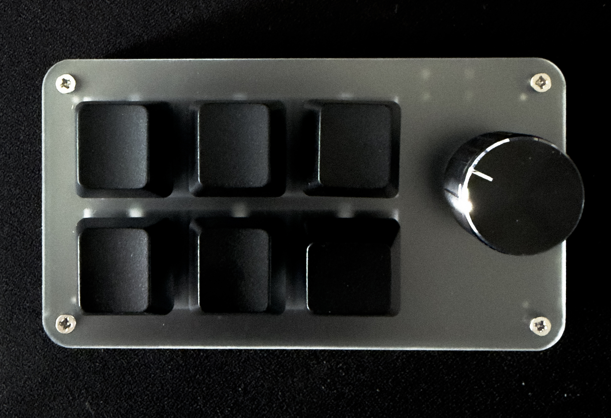
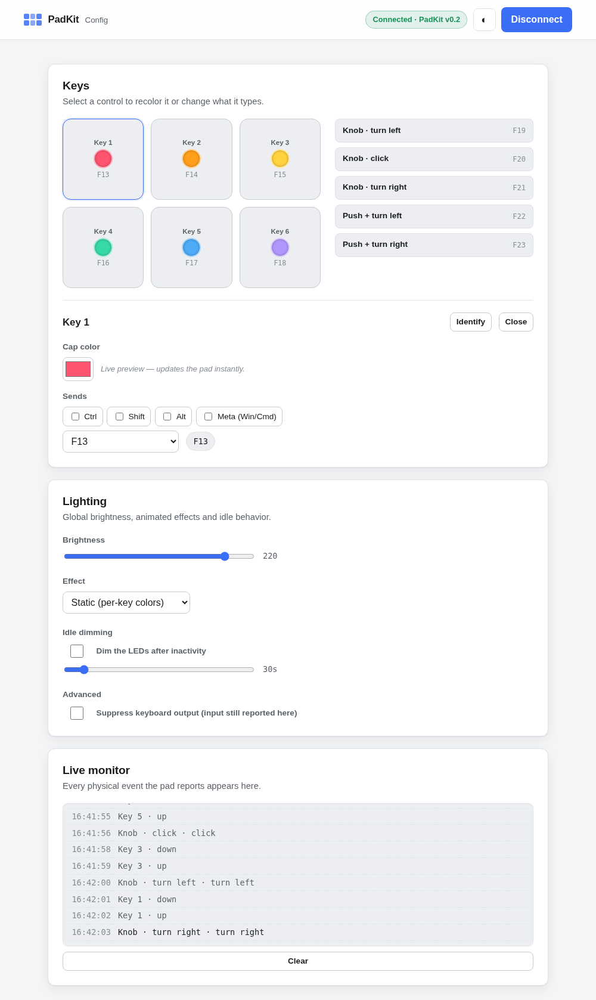

# PadKit

**Custom firmware + tooling for the cheap 6-key + rotary-knob CH552 macropad — make every key and the knob do whatever you want, and set it up from your browser.**



### Is this your device?

Any **CH552 / CH552G macropad with 6 keys + 1 rotary knob** that enumerates as USB `1189:8890`. It's sold under many names — the reference unit was bought as *"SinLoon Mini Macro Programmable Keyboard, 6 Keys 1 Knob"* on Amazon; the same board shows up on AliExpress/eBay as a generic "6-key knob macro keypad." Internal wiring varies between clones — the included [scanner](firmware/scanner/) maps yours if the defaults don't fit.

*All three tiers below are hardware-validated on a real pad.*

## What you can do

| | What | Install |
|---|---|---|
| **Bind keys** | Firmware sends standard **F13–F23** — bind them in any OS, AutoHotkey, Karabiner, Home Assistant, anything. | flash once |
| **Configure in the browser** | [**Open the config tool**](https://denniswjpg.github.io/padkit/config.html) → set per-key colors, brightness, and what shortcut each key sends → save to the pad. | none (Chrome/Edge) |
| **Automate & integrate** | The [`padkitd`](daemon/) daemon turns keys/knob into shell commands, HTTP webhooks, or event-driven LEDs — and exposes an **MCP server** so AI agents can drive the pad. | one binary |

[](https://denniswjpg.github.io/padkit/config.html)

*↑ the browser config tool — [try it with no hardware](https://denniswjpg.github.io/padkit/config.html?demo=1).*

## How fast

**Browser, ~2 minutes, nothing to install** (macOS/Linux):

1. Get the pad into bootloader mode — [open the case, bridge **SW2** while plugging in USB](docs/flashing.md) (photos in the guide).
2. [**Flash it in the browser →**](https://denniswjpg.github.io/padkit/flash.html) (Connect → done).
3. Replug, [**open the config tool →**](https://denniswjpg.github.io/padkit/config.html), and set your colors/keys.

**Prefer the terminal?** `cd flasher && make` then `./flasher/isp55e0 -f firmware/padkit.bin`. Grab prebuilt `padkit.bin` and the `padkitd` binaries from the [latest release](https://github.com/denniswjpg/padkit/releases/latest).

## Good to know

- **It's unbrickable.** The CH552 bootloader lives in mask ROM — a bad flash is always recoverable by re-entering bootloader mode.
- **The bootloader window is short — be quick.** After the SW2 short the pad only stays in bootloader for a few seconds, so hit **Connect & flash** and pick the device in Chrome's popup promptly. Easier: use the flasher's **"wait for bootloader"** button first — it auto-flashes the moment the pad appears, no rush.
- **Windows** needs a one-time Zadig → WinUSB driver swap for the *bootloader* (a CH552 ROM quirk, same for CLI and browser). macOS/Linux need nothing (Linux: one udev rule).
- **Config persists on the pad** (DataFlash) — colors and keymap survive unplugging; the daemon is optional.

## Input map

| Control | Sends |
|---|---|
| Keys 1–6 | F13 · F14 · F15 · F16 · F17 · F18 (real down/up → tap or hold) |
| Knob turn | CCW → F19 · CW → F21 |
| Knob click | F20 |
| Push + turn | CCW → F22 · CW → F23 |

Full spec — per-OS binding recipes, the LED/keymap HID protocol, and worked examples for AI agents — is in [`AGENTS.md`](AGENTS.md) ([`llms.txt`](llms.txt) points agents at it).

## Make it yours

Six keys and a knob that can send any shortcut, run any command, hit a webhook, or talk to an AI agent. Some starting points:

- **Calls** — mute/unmute and camera toggle on keys, volume on the knob.
- **Media** — play/pause and skip on keys, scrub or volume on the knob.
- **Coding** — run tests, format, stage+commit on keys; undo/redo or editor zoom on the knob.
- **Home Assistant** — a key per scene, the knob to dim the lights (via a webhook).
- **AI coding agents** — approve or interrupt the agent from a key, scroll its output with the knob, and let it light a key when it needs you (through the daemon's MCP server). *This is what PadKit was originally built for — a physical remote for an AI assistant.*

### Hand it to your AI agent

You don't have to wire anything by hand — PadKit ships a full machine-readable spec so an agent can do it for you. Paste this to Claude (or any coding agent) and fill in the blank:

> I have a **PadKit** macropad — 6 keys + a rotary knob, open-source CH552 firmware. Its full spec (input map, the LED/keymap HID protocol, and the `padkitd` companion with shell / webhook / MCP actions) is at https://github.com/denniswjpg/padkit/blob/main/AGENTS.md — read it first. Then help me set up my pad to **‹what you want it to do›**. I'm on ‹macOS / Windows / Linux› and I'd prefer ‹plain OS keybindings / the padkitd daemon / the MCP server›. Give me the exact config or steps.

From the spec the agent can generate your OS keybindings, a `padkitd` config file, or an MCP integration — no protocol reverse-engineering required.

## Layout & licensing

```
firmware/   CH552 firmware + scanner/   — CC-BY-SA (built on wagiminator's CH552 stack)
flasher/    patched isp55e0 CLI flasher — GPLv3 (from frank-zago/isp55e0)
web/        WebHID config + WebUSB flasher (→ GitHub Pages) — MIT
daemon/     Go companion + MCP server   — MIT
docs/ · examples/ · AGENTS.md           — MIT
```

Each directory states its own license; see root [`LICENSE`](LICENSE). Thanks to **wagiminator** (CH552 stack), **frank-zago/isp55e0** (flasher), and **QMK/VIA** (the vendor-HID/WebHID approach).
