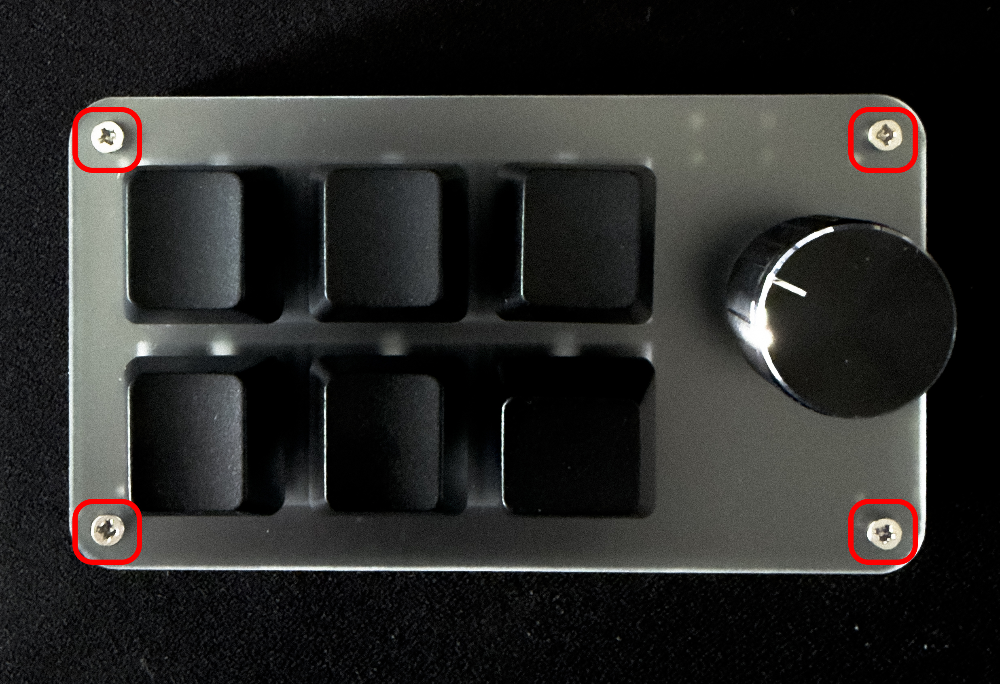
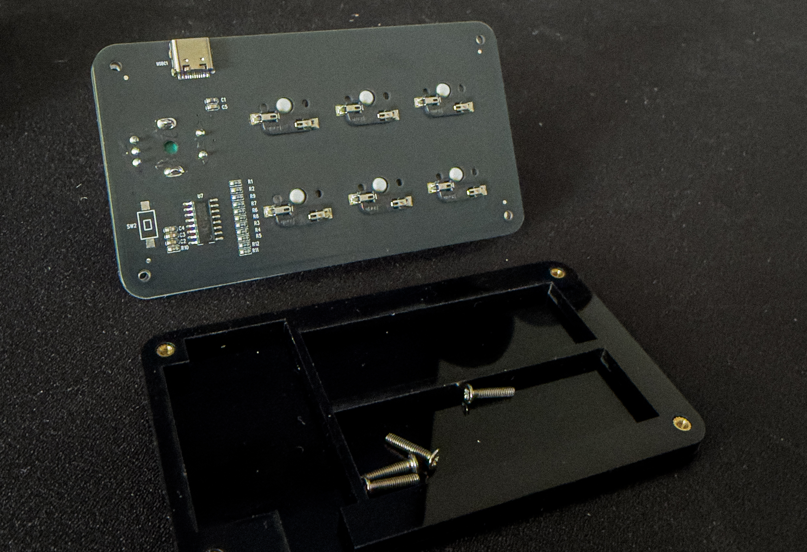
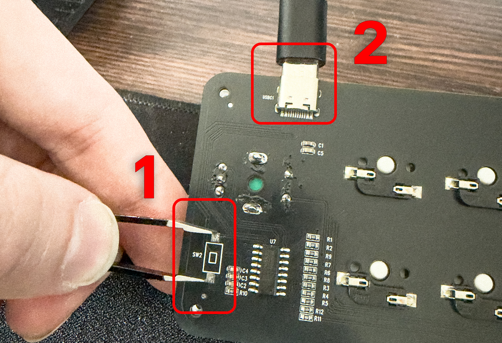

# Flashing & recovery

How to write firmware to a PadKit board and how to recover from a bad flash. The
target is a **WCH CH552G**; it is flashed over the chip's built-in **WCH ISP
bootloader** using the `isp55e0` CLI in [`../flasher/`](../flasher/).

**You cannot brick the chip through USB flashing.** The bootloader lives in mask
ROM and is never overwritten — see [Recovery](#recovery). Flash freely.

---

## 1. Build the flasher (once)

The flasher needs `gcc` and libusb-1.0 headers.

- Debian / Ubuntu: `sudo apt install build-essential libusb-1.0-0-dev`
- Fedora / RHEL: `sudo dnf install gcc libusb1-devel`
- macOS (Homebrew): `brew install libusb`

Then:

```sh
cd flasher
make
```

This produces the `isp55e0` binary in `flasher/`. It is a lightly patched fork of
[frank-zago/isp55e0](https://github.com/frank-zago/isp55e0) (GPLv3); the two PadKit
patches are documented in [`../flasher/README.md`](../flasher/README.md) (clear a
stalled bootloader endpoint on connect; treat the CH552 v2.50 bootloader's missing
reboot-ACK as non-fatal).

You do not need to rebuild the *firmware* to flash a board — a prebuilt
`firmware/padkit.bin` is provided. Rebuilding firmware needs **SDCC** (`cd
firmware && make`).

---

## 2. Enter the bootloader (SW2)

The CH552 enters its ISP bootloader when **P1.5 is pulled LOW at power-up**. On the
reference board that pin is the **SW2** boot button, located on the **back of the PCB**
next to the `U7` chip — so you open the case and bridge the SW2 pads with tweezers while
plugging in USB. It's a two-hand, ~10-second job; nothing is soldered or permanent.

> The reference board is this 6-key + knob unit:
>
> 

**Step 1 — Remove the four faceplate screws** (one at each corner).



**Step 2 — Lift the PCB out** so its back is exposed. You're looking for `SW2` (a small
button footprint near the `U7` chip, lower-left) and the `USBC1` connector along the top edge.



**Step 3 — Bridge the SW2 pads and keep holding, then plug in USB.** Touch tweezers (or a
jumper) across the two `SW2` pads **①** and, while still holding, connect the USB-C cable at
`USBC1` **②**. Release SW2 a second after it powers up.



The board now enumerates as USB **`4348:55e0`** (WCH ISP mode) instead of running the app.
Confirm:

```sh
lsusb | grep -i 55e0        # expect: ID 4348:55e0  (some units report 1a86:55e0)
```

> **Other layouts:** `P1.5` is also key 4's column pin, so on some clones holding **key 4**
> while plugging in enters the bootloader without opening the case — try that first if your
> board differs from the photos. See [`hardware.md`](hardware.md) for the pin map.

---

## 3. Flash

From the `flasher/` directory, with the board in bootloader mode:

```sh
./isp55e0 -f ../firmware/padkit.bin
```

`isp55e0` erases, writes, and reads back to verify. On the CH552 v2.50 bootloader
you may see a harmless final warning that the reboot was not acknowledged
("unplug/replug to boot the new firmware") — the image is already written and
verified at that point. **Unplug and replug** to run the new firmware.

Other useful invocations:

```sh
./isp55e0                       # query only — confirms the bootloader is detected
./isp55e0 -c ../firmware/padkit.bin   # verify flash against a binary, no write
./isp55e0 --help                # full option list
```

If you only have an iHex image, convert it first:

```sh
objcopy -I ihex -O binary firmware.hex firmware.bin
```

---

## 4. Per-OS notes

### Linux — udev rule for non-root flashing

By default only root may open the bootloader device. Install the bundled rule so a
normal user can flash:

```sh
sudo cp flasher/99-wch-isp.rules /etc/udev/rules.d/99-wch-isp.rules
sudo udevadm control --reload-rules && sudo udevadm trigger
```

Then **replug** the board. The rule grants access to both `4348:55e0` and
`1a86:55e0` (the two VID:PIDs the ROM bootloader may present). No kernel driver is
needed.

### Windows — one-time driver swap (Zadig → WinUSB)

The CH552 ROM bootloader ships **no WCID / Microsoft-OS descriptors**, so Windows
will not auto-bind it to a libusb-compatible driver. Do this once:

1. Enter the bootloader (SW2 procedure) so **`4348:55e0`** appears in Device
   Manager.
2. Run **[Zadig](https://zadig.akeo.ie/)**, select the `4348:55e0` device, and
   install the **WinUSB** driver for it. (WinUSB specifically — not libusb-win32 —
   if you want the same device to also work with a future WebUSB flasher.)

After that, `isp55e0` works on Windows exactly as on Linux. This swap affects only
the **bootloader** device; it does not touch normal HID operation of the finished
macropad. This step is unavoidable for USB-bootloader flashing of this chip (CLI or
browser) and is a property of the chip, not the tool.

### macOS

No driver, no permission file. Enter the bootloader, run `./isp55e0 -f …`.

---

## Recovery

**The CH552 is unbrickable via the USB flashing path.** Its bootloader lives in
mask ROM and cannot be erased or overwritten by an application flash. If a flash is
interrupted, a wrong image is written, or the firmware misbehaves:

1. Unplug the board.
2. Re-enter the bootloader (short SW2 / P1.5 low, plug in, release) — step 2 above.
3. Flash a known-good `padkit.bin` again — step 3.

There is no state a bad application image can leave the chip in that prevents the
ROM bootloader from coming up on the next SW2 power-on. If the board does **not**
enumerate as `4348:55e0` even with SW2 held at plug-in, the problem is electrical
(cable, solder joint, or the SW2 pad/pin itself), not a corrupted flash — check the
wiring in [`hardware.md`](hardware.md), not the firmware.
</content>
